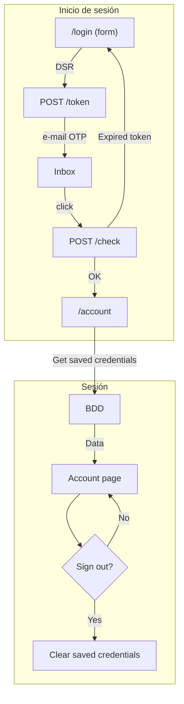

# Flujo de autenticación backend‑frontend

```mermaid
flowchart TD
    %% ---------- LOGIN & VERIFICACIÓN ----------
    subgraph "Inicio de sesión"
        A["/login (form)"] -->|DSR| B[POST /token]
        B -->|e-mail OTP| D[Inbox]
        D -->|click| E[POST /check]
        E -->|OK| F["/account"]
        E -->|Expired token| A
    end

    %% ---------- SESIÓN ----------
    subgraph "Sesión"
        F -->|Get saved credentials| F2[BDD]
        F2 -->|Data| G[Account page]
        G --> H{Sign out?}
        H -->|Yes| I["Clear saved credentials"]
        H -->|No| G
    end

```